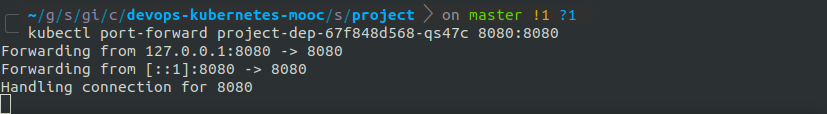
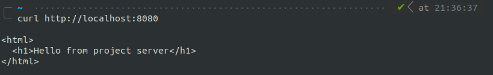
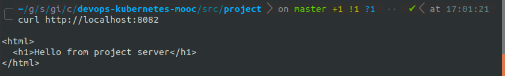

## [Part 1](https://devopswithkubernetes.com/part-1)

### 1.01

Create a new deployment using the course main application image.

`$ kubectl create deployment hashgenerator-dep --image=chanioxaris/devops-k8s-mooc-main-app`

List available pods.

`$ kubectl get pods`

View logs of the newly created pod.

`$ kubectl logs -f hashgenerator-dep-bb955cc76-zj6v7`

### 1.02

Create a new deployment using the course project image.

`$ kubectl create deployment project-dep --image=chanioxaris/devops-k8s-mooc-project`

List available pods.

`$ kubectl get pods`

View logs and verify that server has been started.

`$ kubectl logs -f project-dep-8466769d84-p9kjk`

### 1.03

The manifest directory is located [here](../src/main-application/manifests).

Create a new deployment by applying the manifest.

`$ kubectl apply -f manifests/deployment.yaml`

View logs and verify that running successfully.

`$ kubectl logs hashgenerator-dep-688c764588-2j626`

### 1.04

The manifest directory is located [here](../src/project/manifests).

Create a new deployment by applying the manifest.

`$ kubectl apply -f manifests/deployment.yaml`

View logs and verify that the server is running.

`$ kubectl logs project-dep-67f848d568-4dgkx`

### 1.05

Forward the server port 8080 into 8080 local port.

`$ kubectl port-forward project-dep-67f848d568-qs47c 8080:8080`

Check if port forwarding is working.

`$ curl http://localhost:8080`

### 1.06

The manifest service file is located [here](../src/project/manifests/service.yaml).

Apply the new manifest service.

`$ kubectl apply -f manifests/service.yaml`

Check if we can access the server from outside.

`$ curl http://localhost:8082`

### 1.07

The service file is located [here](../src/main-application/manifests/service.yaml).

Apply the new service.

`$ kubectl apply -f manifests/service.yaml`

The ingress file is located [here](../src/main-application/manifests/ingress.yaml).

Apply the new ingress.

`$ kubectl apply -f manifests/ingress.yaml`

Check if we can access the server from outside.

`$ curl http://localhost:8081`

