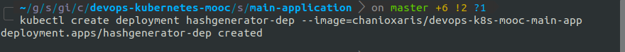

## [Part 1](https://devopswithkubernetes.com/part-1)

### 1.01

Create a new deployment using the course main application image.

`$ kubectl create deployment hashgenerator-dep --image=chanioxaris/devops-k8s-mooc-main-app`

List available pods.

`$ kubectl get pods`

View logs of the newly created pod.

`$ kubectl logs -f hashgenerator-dep-bb955cc76-zj6v7`

### 1.02

Create a new deployment using the course project image.

`$ kubectl create deployment project-dep --image=chanioxaris/devops-k8s-mooc-project`

List available pods.

`$ kubectl get pods`

View logs and verify that server has been started.

`$ kubectl logs -f project-dep-8466769d84-p9kjk`

